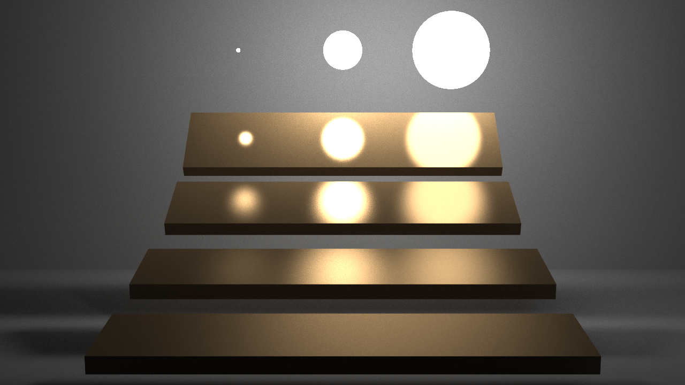

# PathTracer

## 简介

本程序实现了Monte Carlo路径追踪算法，并在实现中使用了下列技术。

- 使用BVH对光线与场景求交进行加速
- 分层采样
- 对光源采样
- 根据BRDF的重要性采样
- 俄罗斯轮盘
- 伽马校正

## 开发环境

本项目使用的一些软件和库以及它们的版本如下表所示。

|  软件/库  |  版本  |
| :-------: | :----: |
| Linux内核 | 5.11.6 |
|    GCC    | 10.2.0 |
|   CMake   | 3.19.7 |
|  Assimp   | 5.0.1  |
|    Qt     | 5.15.2 |
|  OpenMP   | 11.1.0 |

其中Assimp用于场景以及材质、纹理的读取；Qt用于相关的向量计算，并且提供图形用户界面和显示绘制结果；OpenMP用于提供CPU级别的并行运算，从而提高程序运行效率。

## 使用说明

- 编译并运行程序后，可以通过界面上的单选框选择要绘制的场景。
- 通过界面上的文本框，可以设置一些绘制中使用的参数，它们的含义如下所示。
  - Sample per Pixel (SPP)：每个像素的采样数。
  - 阈值生成方法：用于Phong的重要性采样，对于phong材料的brdf采样（既有漫反射分量又有镜面反射分量），需要有一个采样阈值来判断生成的光线的时候是生成漫反射光线还是镜面反射光线。
- 设置完成后，点击Calculate按钮即可开始绘制，按钮上方会显示总迭代次数和当前已经完成的迭代次数，绘制结果会显示在设置选项右侧。
- 绘制完成后，可以点击Save按钮保存绘制结果。

## 运行截图
图像的渲染采用渐进渲染的方式，即每迭代完一次，将与之前的渲染结果融合起来，并立马显示如下界面：

在上界面中可以看到当次迭代Iteration的次数（上图为1），和此时总共花费的时间（上图为33.3083s，因为是在mac m1上运行的速度有点慢）。
渲染结束后，可以按下save按钮。
## 代码说明
### 伪代码
    
    Shade(hitrecord,bounce):
      Caculate self-emisson；
      If glass :
        compute reflect or refract；
        Russian Roulette；
        Shade(newhitrecord,bounce+1)；
      else phong:
        directly sample light；
        Importance sampling based on brdf；
        Russian Roulette；
        Shade(newhitrecord,bounce+1)；

### 类说明
程序中的一些类及它们的说明如下表所示。

|     类      |                   说明                   |
| :---------: | :--------------------------------------: |
|    Point    |     点，包括点的位置、法向量、UV坐标     |
|  Triangle   |                  三角形                  |
|    AABB     |            座标轴对齐的包围盒            |
|     BVH     |                层次包围盒                |
|  Material   | 材质，包括漫反射系数、镜面反射系数等属性 |
|   Texture   |   纹理，并通过双向线性插值计算纹理颜色   |
|    Mesh     |    三角形网格，以及其对应的材质和纹理    |
| Environment |                 环境贴图                 |
|    Scene    |       整个场景，包括网格和环境贴图       |
|     Ray     |                   光线                   |

# 运行结果

Cornell Box (SPP=64)

veach-mis (SPP=1000, 高光抑制法)

Cornell Box (SPP=1000)

